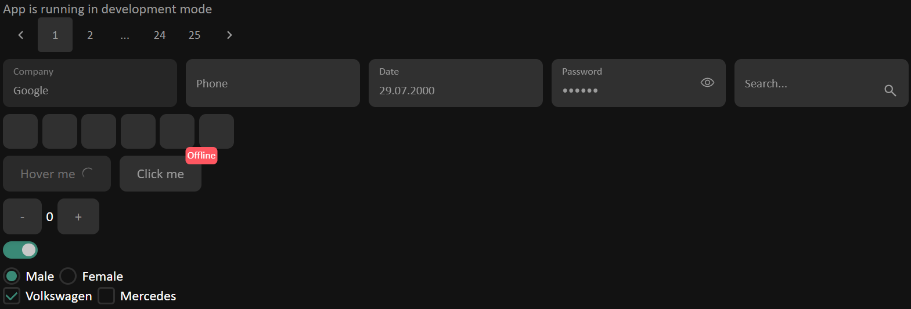
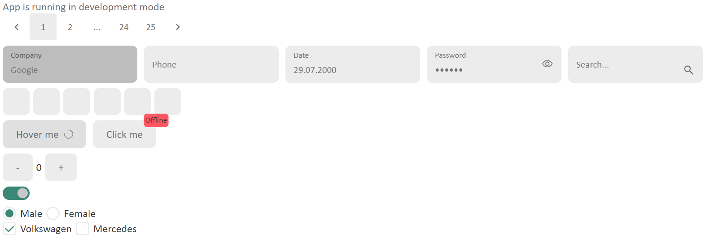
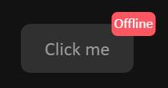
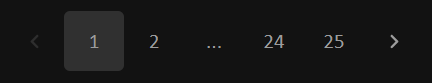
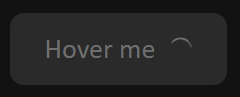
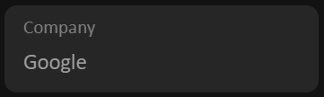
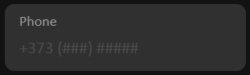

<h1 align="center">Atom</h1>

---

**Atom** is a npm user interface library based on React. It is fully customizable and allows you to use dark and light modes

## Installation

### With npm:
```shell
npm install @atom-dev/material
```

### With Yarn:
```shell
yarn add @atom-dev/material
```

## Getting started with Atom

Here is an example of a basic app using Atom UI component:

```tsx
import { Button } from "@atom-dev/material";
import "@atom-dev/material/dist/style.css";

const App = () => (
    <Button 
        interval={500} 
        onClick={() => console.log("Clicked!")}
    >
        Click
    </Button>
);

export default App;
```

### Dark and light theme

To activate the possibility of using a dark and light theme, you need to wrap your application in a `ThemeProvider`

```tsx
import { ThemeProvider } from "@atom-dev/material";

const element = (
    <ThemeProvider>
        <App />
    </ThemeProvider>
);
```

#### Dark theme:


#### Light theme (by default):


## Components

In this library you can find a huge number of components that can be useful to you when developing

### Badge

Badge creates a small icon in the SPECIFIED corner of its child element

#### Preview


#### Usage
```tsx
import React from "react";
import useToggle from "@/hooks/useToggle";

import { Badge, Button } from "@atom-dev/material";
import "@atom-dev/material/dist/style.css";

const App = () => {
    const [online, toggle] = useToggle(false);
    
    return (
        <Badge
            color={online ? "green" : "red"}
            content={online ? "Online" : "Offline"}
        >
            <Button interval={500} onClick={toggle}>
                Click me
            </Button>
        </Badge>
    );
}
```

### Paginate

The Pagination component allows the user to select a specific page from a range of pages

#### Preview


#### Usage
```tsx
import React, { useState } from "react";

import { Paginate } from "@atom-dev/material";
import "@atom-dev/material/dist/style.css";

const App = () => {
    const [page, setPage] = useState(0);
    
    return (
        <Paginate
            pageCount={25}
            forcePage={page}
            onPageChange={({ selected }) => setPage(selected)}
        />
    );
}
```

### Button

Buttons allow users to perform actions and make choices with a single click

#### Preview


#### Usage
```tsx
import React from "react";

import { Button } from "@atom-dev/material";
import "@atom-dev/material/dist/style.css";

const App = () => (
    <Button
        loading
        disabled
        interval={500}
        onClick={() => console.log("Clicked!")}
    >
        Click me
    </Button>
);
```

### Input

Text fields allow users to enter and edit text. There are other input fields, such as Number (You can use it when you need a field for entering numbers or phone numbers), Search and Password

#### Preview



#### Usage
```tsx
import React, { useState } from "react";

import { Input } from "@atom-dev/material";
import "@atom-dev/material/dist/style.css";

const App = () => {
    const [state, setState] = useState("");

    return (
        <Input
            disabled
            name="name"
            value={state}
            label="Company"
            onChange={(e) => setState(e.target.value)}
        />
    );
}
```

> Detailed instructions for each component are available in the folder of this component (file README.md )
